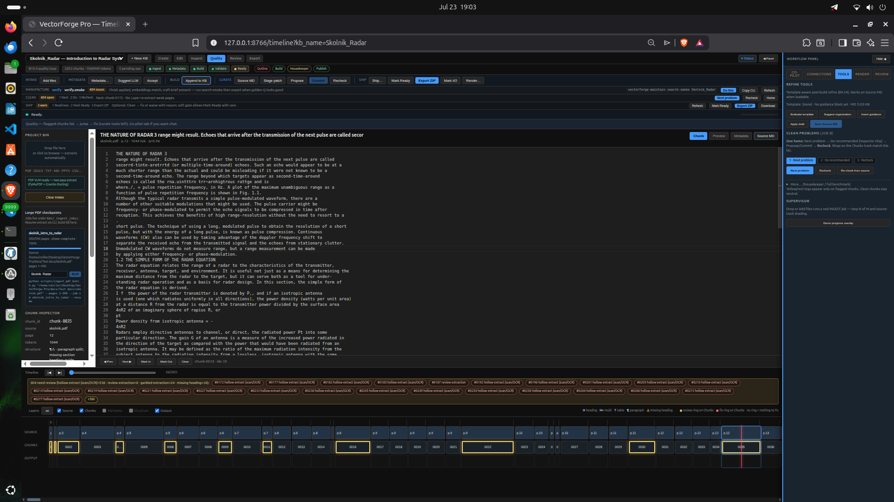

# VectorForge Brick Library

Public collection of **portable knowledge bricks** — bounded, self-contained packages of technical knowledge made with [VectorForge Pro](https://x.com/VectorForgePro).

**Why these bricks exist:** we publish KBs that **demonstrate the range of VF Pro capabilities** — different source shapes (technical PDF papers, multi-site wiki/HTML ops docs, large parameter references, protocol XML, GitBook-style hardware manuals) turned into honest, drop-in packages. The library is a living sample set, not a product dump of the workbench itself.

These are not unbounded RAG dumps.  
Each brick is a finished, handoffable unit: rich Markdown + machine sidecars + embeddings + craft notes, ready for local use, air-gapped environments, or any tool that can read the package.


## Hard corpus on the desk



**Skolnik-class radar PDF on the Pro desk** (~2.8k chunks): timeline, quality rings on hollow/garble clips, problem strip, and chunk inspector on real extract mess (dual-stream / debris still visible in places).  

We **dogfood commercial-class difficulty privately** for stress and screenshots. We **do not republish commercial textbooks** as downloadable bricks. For a **rights-clear, measurable** demo you can re-run yourself, see **[Look, don’t trust me](#look-dont-trust-me)** below (ArduPilot Plane, 20 questions + citations).

## Look, don’t trust me

The highest-leverage way to judge this library is not the README — it is a **published retrieval demo**.

**[RETRIEVAL_DEMO_ArduPilot_Plane.md](RETRIEVAL_DEMO_ArduPilot_Plane.md)** — **20 real questions** against the published `ArduPilot_Plane` brick: top-3 hits with **cosine scores**, **chunk ids**, **headings**, and **source excerpts** (not LLM-invented answers). Machine-readable twin: [`demos/ardupilot_plane_eval.json`](demos/ardupilot_plane_eval.json).

Ten minutes of reading beats any claim that “bricks retrieve well.” If a hit looks wrong, open an issue.


---

## What is a knowledge brick?

A **knowledge brick** is a portable, versionable unit of technical knowledge designed to stay honest and usable over time.

Typical contents:
- Primary rich Markdown (human-readable source of truth)
- `kb.json` + chunk indexes
- Embeddings + provenance
- Craft brief (what the brick is for, known limits, answer policy)
- Quality / deficiency notes (we surface problems instead of hiding them)
- Handoff / original source companions where useful

Bricks are sized to stay human-scale. **Design guidance** is roughly **hundreds to low thousands of chunks** per brick (not a hard minimum — the flagship Plane ops brick is **335** chunks; the Plane params brick is larger on purpose). Bigger topics are **composed** from multiple bricks (ops vs params vs protocol), not one giant pile.

---

## What’s in this library

| Brick | Description | Status |
|-------|-------------|--------|
| [Advanced_Rockets](bricks/Advanced_Rockets/) | Advanced chemical rocket engines (Haidn / RTO-EN-AVT-150 educational notes) | **v1 portable ZIP** |
| [ArduPilot_Plane](bricks/ArduPilot_Plane/) | Plane operations / wiki-oriented facet | **v1 portable ZIP** |
| [ArduPilot_Plane_Params](bricks/ArduPilot_Plane_Params/) | Plane parameters reference facet | **v1 portable ZIP** |
| [ArduPilot_MAVLink](bricks/ArduPilot_MAVLink/) | MAVLink protocol facet | **v1 portable ZIP** |
| [ArduPilot_MissionPlanner](bricks/ArduPilot_MissionPlanner/) | Mission Planner GCS facet | **v1 portable ZIP** |
| [CubePilot_FC](bricks/CubePilot_FC/) | CubePilot / Cube hardware docs | **v1 portable ZIP** |
| [DroneCAN](bricks/DroneCAN/) | DroneCAN protocol | **v1 portable ZIP** |
| [UAVCAN_cvra](bricks/UAVCAN_cvra/) | UAVCAN / CVRA-oriented facet | **v1 portable ZIP** |

Each brick folder has `*_portable.zip` + `LIBRARY_CARD.md` (purpose, rights, residual notes, load tips). Machine index: [`catalog.json`](catalog.json).

**Not affiliated with or endorsed by** the ArduPilot, CubePilot, DroneCAN, or UAVCAN projects. Source documentation remains under **upstream licenses** — see each card. ArduPilot wiki-class material is typically **CC BY-SA**; derived bricks should keep **attribution + ShareAlike** on that content. Cards state the brick’s license position explicitly. These packs are derived retrieval bricks for tinkerers and integrators.

This first wave uses only external / open technical sources. Nothing proprietary or unscreened is published here.

---


## Who this is for (positioning)

**Strongest fit:** air-gapped, restricted, or defense-adjacent integrators who need **local, attributed, offline** knowledge with **visible limits** — not another cloud scrape of the live wiki.

**Everyday online hobby use:** the live ArduPilot docs may still win for “latest only.” These bricks win when you need a **frozen, portable, citable package** you can keep, audit, and run without phoning home.

## How to use a brick

**→ Full path:** [GETTING_STARTED.md](GETTING_STARTED.md) (5–15 minutes)

1. Download the `*_portable.zip`
2. Unzip
3. Load it **without requiring VectorForge** — plain Markdown, `chunks.jsonl`, or embeddings cosine rank. Worked notes: [PORTABILITY.md](PORTABILITY.md). VF Runtime is optional.
4. Read the **LIBRARY_CARD** (snapshot date, named residual, license) before trusting hits.
5. When ranking semantically, **skip** chunks with `exclude_from_rag` / `muted` (figure-shell debris).

No account required. No cloud dependency.

---

## Feedback wanted

This library exists to get real-world feedback, not just stars.

I especially want to hear:
- Did the brick load and retrieve cleanly in your setup?
- What felt missing, unclear, or over-engineered?
- Where did the extraction honesty (quality notes, figure-shell handling, dual-stream flags, etc.) help — or get in the way?
- Would you actually keep and maintain a brick like this?

**One feedback channel for bricks:** open an [Issue](../../issues) on **this** repo with the brick name in the title — prefer the **Brick feedback** issue template (query + expected vs got + loader). Not the private Pro monorepo. Optional: reply on X [@VectorForgePro](https://x.com/VectorForgePro).

Honest criticism is more useful than polite praise.

---

## Design stance (short version)

- **Problems stay visible.** We do not silently invent fixes for content we did not create.
- **Extraction limits are expected.** Real PDFs, manuals, and decks have hollow pages, dual-stream debris, and figure shells. The brick records them.
- **Local-first and air-gap capable.** The package should work without phoning home.
- **Non-data-scientists should be able to manufacture and maintain these.** That is the whole point of the workbench.

---

## Repo layout

```
vf-brick-library/
├── README.md                 ← you are here
├── GETTING_STARTED.md        ← drop-in path (start here)
├── PORTABILITY.md            ← load without VectorForge
├── RETRIEVAL_DEMO_*.md       ← published Q&A evidence
├── catalog.json              ← machine-readable index
├── demos/                    ← eval JSON twins
├── bricks/
│   ├── <Brick_Name>/
│   │   ├── <Brick_Name>_portable.zip
│   │   └── LIBRARY_CARD.md
│   └── ...
└── .github/ISSUE_TEMPLATE/   ← brick feedback form
```

---

## About VectorForge Pro

VectorForge Pro is a local-first timeline-native workbench for turning heterogeneous source material (PDFs, Word, PowerPoint, HTML, spreadsheets, manuals…) into high-quality knowledge bricks.

It treats knowledge bases like long-form media projects: non-destructive editing, quality orchestration, craft briefs, and honest extract loops instead of green-smoke-on-empty-books.

**This repository is the public gallery of outputs** — bricks that show what the factory can produce across domains and file types. It is not the Pro application, Engine source, or internal product documentation.

- X: [@VectorForgePro](https://x.com/VectorForgePro)
- Builder: [@CMiller111111](https://x.com/CMiller111111)

---

*Built for operators who treat knowledge bases as living products rather than one-time uploads.*
